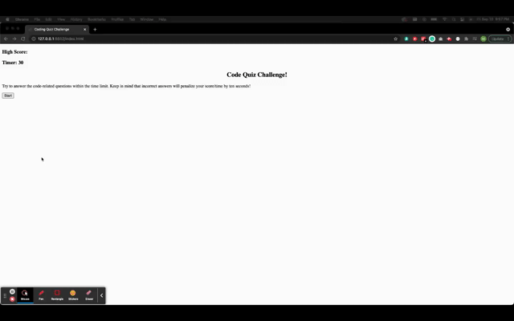

# JavaScript Coding Quiz

## Description
This short coding quiz gives the user 30 seconds to answer 5 questions. Each wrong answer removes 10 seconds from the timer. If you make it to the end, the remaining time becomes your score. Submit your initials to the score board. If you run out of time, it's game over. Good luck!  
[Take the quiz](https://mattyb5000.github.io/coding-quiz/)

